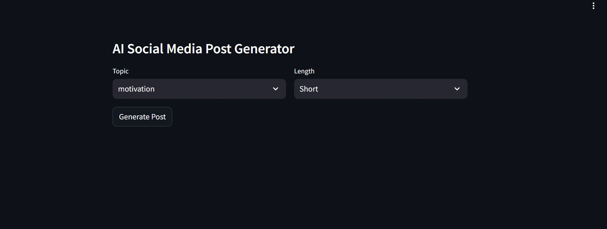

# AI Social Media Post Generator (GenAI + Few-Shot Prompting)

This project is an **AI-powered social media content generator** that learns the writing style of a LinkedIn creator and generates new posts with a similar tone and structure.

The application analyzes previous posts to understand patterns such as **topic, language, and length**, and then uses a **Large Language Model (LLM)** with few-shot prompting to generate new posts that match the influencer's style.

---

## Project Preview



---

## Problem Statement

Many LinkedIn influencers struggle to consistently produce engaging posts while maintaining their unique writing style.

This project solves that problem by:

* Learning patterns from previous posts
* Extracting important attributes such as **topic, language, and post length**
* Generating new posts that match the **same tone and structure**

Example scenario:

> Suppose Mohan is a LinkedIn influencer who wants help writing new posts.
> He provides his past posts to the system.
> The tool analyzes those posts and then helps generate new content in the same style.

---

# Technical Architecture


The system works in **two main stages**.

---

## Stage 1 — Data Processing

Past LinkedIn posts are analyzed and structured into metadata such as:

* Topic
* Language
* Post length
* Engagement metrics

This structured dataset helps guide the generation process.

---

## Stage 2 — Post Generation

When the user selects:

* Topic
* Language
* Post Length

The system:

1. Finds similar posts from the dataset
2. Uses them as **few-shot examples**
3. Sends a prompt to the LLM
4. Generates a new post in the same style

---

# Features

* AI-powered **LinkedIn post generation**
* Few-shot prompting for **style matching**
* Topic-based post creation
* Adjustable post length
* Streamlit-based interactive UI
* Integration with **Groq LLM API**

---

# Tech Stack

**Frontend**

* Streamlit

**Backend**

* Python

**LLM Framework**

* LangChain

**LLM Provider**

* Groq API

**Data Processing**

* Pandas
* NumPy

**Deployment**

* Render

---

# Project Structure

```
project-genai-post-generator
│
├── data
│   ├── social_media_posts.json
│   └── processed_posts.json
│
├── main.py
├── preprocess.py
├── post_generator.py
├── few_shot.py
├── llm_helper.py
│
├── requirements.txt
├── start.sh
│
└── resources
    ├── tool.jpeg
    └── architecture.jpg
```

---

# Setup Instructions

## 1. Clone the Repository

```
git clone https://github.com/yourusername/project-genai-post-generator.git
cd project-genai-post-generator
```

---

## 2. Create Virtual Environment

```
python -m venv venv
source venv/bin/activate
```

Windows:

```
venv\Scripts\activate
```

---

## 3. Install Dependencies

```
pip install -r requirements.txt
```

---

## 4. Add Groq API Key

Create a `.env` file in the project root.

```
GROQ_API_KEY=your_api_key_here
```

You can generate your API key here:

[https://console.groq.com/keys](https://console.groq.com/keys)

---

## 5. Run the Application

```
streamlit run main.py
```

Open the application in your browser:

```
http://localhost:8501
```

---

# Deployment

The project can be deployed on:

* Render
* Streamlit Cloud
* Docker
* AWS / GCP

Example Render start command:

```
streamlit run main.py --server.port $PORT --server.address 0.0.0.0
```

---

# Example Workflow

1. Upload past LinkedIn posts
2. The system analyzes post attributes
3. User selects topic and length
4. Few-shot examples are selected
5. LLM generates a new post
6. User can copy and publish it

---

# Future Improvements

* Support for multiple social media platforms
* Post scheduling integration
* Engagement prediction
* Fine-tuned model for style replication
* Multi-language generation

---

# License

This project is licensed under the **MIT License**.

However:

* Commercial usage requires prior written permission from the author.
* Proper attribution must be included in all copies or derivatives.

---

# Acknowledgement

Inspired by educational content from **Codebasics** and built as a hands-on **Generative AI learning project**.


